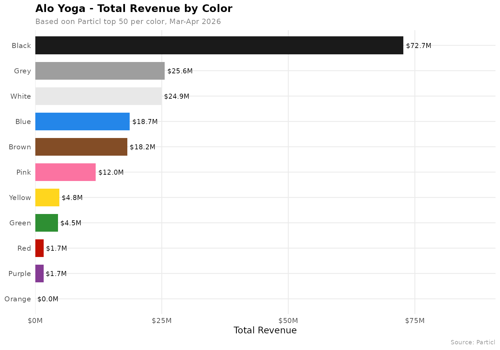
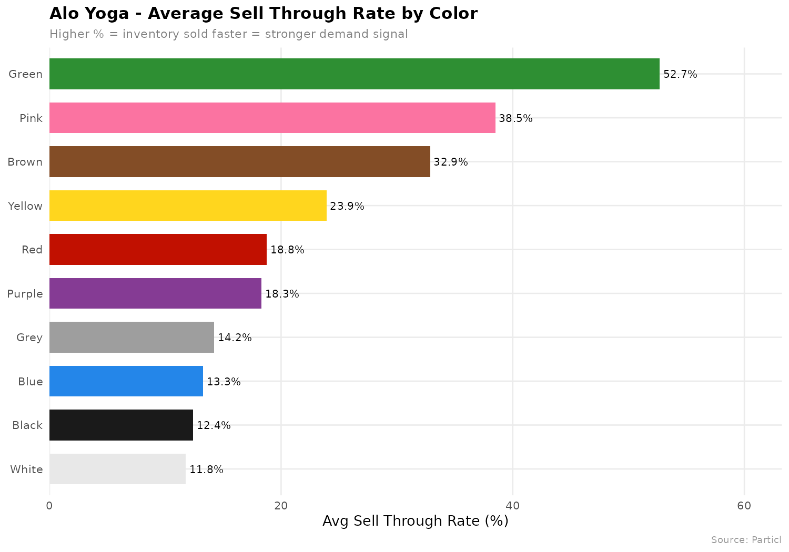
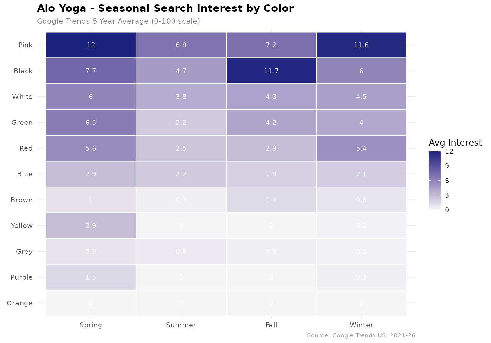
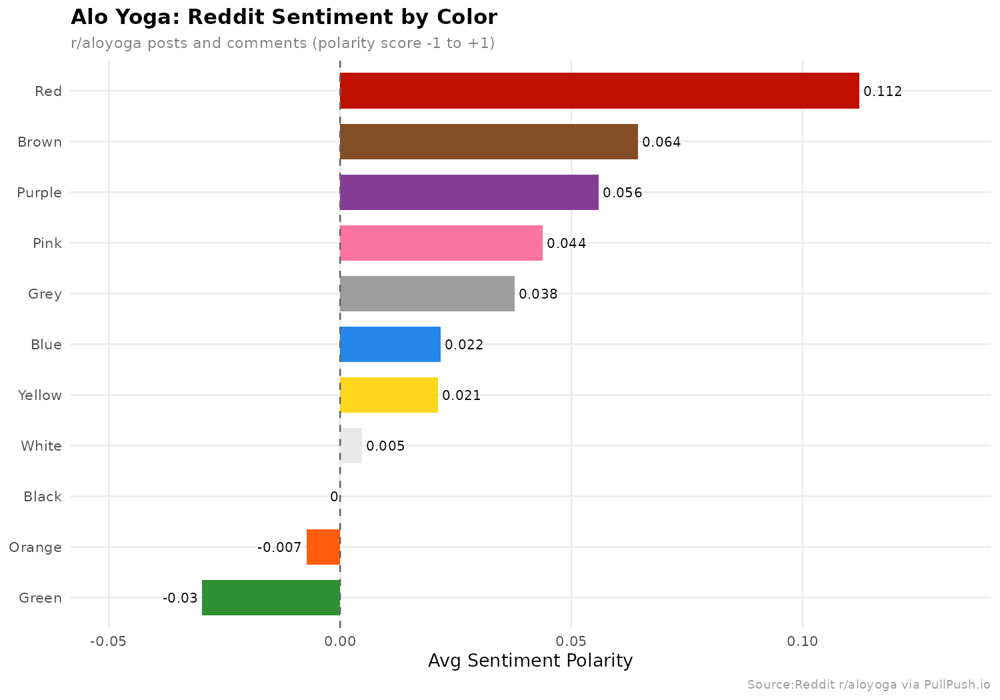
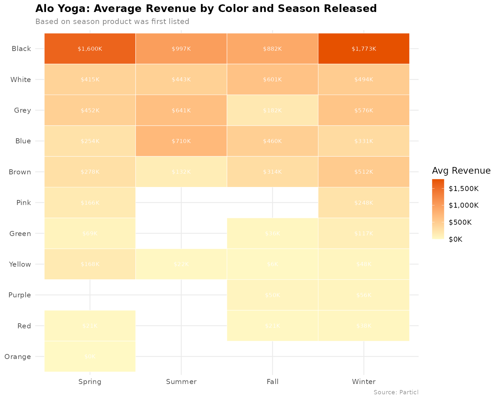
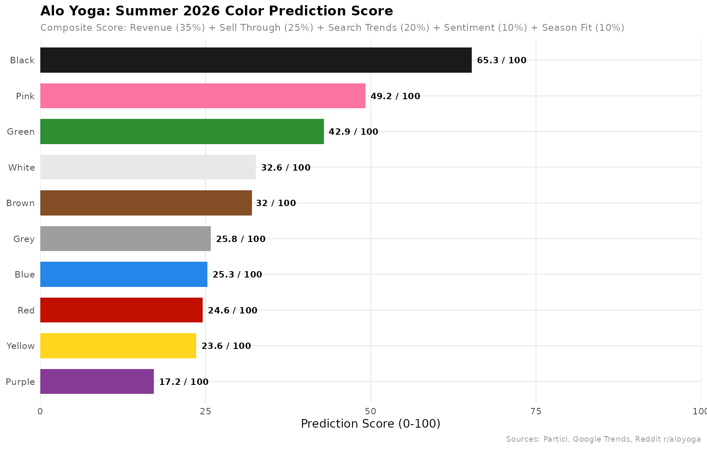

# Alo Yoga Color Trend Analysis & Summer 2026 Prediction

[May 20, 2026](https://img.shields.io/github/last-commit/[nataliamorelos]/alo-yoga-color-analysis)

## Project Overview
This project analyzes Alo Yoga product sales data to determine whether seasonality drives color performance and if so, predict which colors the brand should select for the upcoming Summer 2026 season.

The analysis combines three independent data sources to build composite prediction scores for each color:
- **Sales Data** from Particl (top 50 products per color)
- **Search Demand** from Google Trends (5-year weekly data, US only)
- **Consumer Sentiment** from Reddit r/aloyoga (799 posts and comments)

## Repository Structure

```
alo-yoga-color-analysis/
├── data/
│   ├── raw/                    # Particl CSVs (11 color files)
│   └── processed/              # Cleaned and merged datasets
├── R/
│   ├── 01_load_and_clean.R     # Load + clean all 11 Particl CSVs
│   ├── 02_google_trends.R      # Pull Google Trends data
│   ├── 03_merge_and_analyze.R  # Merge datasets + build prediction
│   └── 04_visualize.R          # All 6 visualizations
├── Python/
│   └── reddit_sentiment.py     # Reddit sentiment analysis
├── output/
│   └── plots/                  # All 6 exported charts
└── README.md
```

---

## Key Questions
1. Does season influence which colors perform best?
2. Which colors sell out fastest relative to their catalog size?
3. What does consumer sentiment reveal about color perception?
4. Which color should Alo highlight for Summer 2026?
 
---

## Prediction: Summer 2026

1. Black | 65.3 | Dominant year round
2. Pink | 49.2 | Top Summmer candidate with highest search demand and sell through
3. Green | 42.9 | Highest sell through but most negative sentiment
4. White | 32.6 | Safe Spring/Summer neutral
5. Brown | 32 | Fall staple, strong sell through
6. Grey | 25.8 | Reliable but not exciting for consumers
7. Blue | 25.3 | Consistent but no strong seasonal appeal
8. Red | 24.6 | Most underleveraged color, high sentiment but little releases
9. Yellow | 23.6 | Very good sell through, another prospect worth considering
10. Purple | 17.2 | Low across all metrics except sentiment, third highest color mentioned
11. Orange | NA | $0 revenue, near zero interest, possible niche opportunity

> ** Recommendation:** Pink has the strongest possibiltiy of success among the non-neutral colors for Summer 2026. The color has the strongest search interest value of 12.0. To put into persepctive Black, a neutral color, peaks at 11.7 and has an extensive product catalog. Pink has far fewer product releases, signalling a demand gap that Alo should exploit.

---

## Visualizations

### Revenue by Color


### Sell Through Rate by Color


### Seasonal Search Interest Map


### Reddit Sentiment by Color


### Revenue by Season Heatmap


### Summer 2026 Prediction


---

## Tools & Methods

**Particl** | Alo Yoga sales rank, revenue data, product list
**R** | Data cleaning, analysis, visualizations
**Python** | Reddit sentiment scraping 
**Google Trends API** | Search interest time series
**ggplot2** | All charts and visualizations
**TextBlob** | Sentiment scoring
**Github Codespaces** | Development environment

---

## Key Findings

**Seasonality does improve color performance:**
- Black search interest peaks in Fall but products released in Summer perform better (Fall avg revenue $882K vs $997K Summer)
- Brown consistently delivers in Fall/Winter with a $512K avg revenue in Winter and highest search interest in Fall
- Pink peaks in Spring/Summer with the highest search signal of all colors and seasons at 12.0
- Green demand spikes in Spring but there is negative sentiment year round (opportunity to fix)


**The Green Paradox**
Green has the highest sell through rate of 100 meaning inventory sells out the fastest. Yet, Reddit sentiment remains the most negative of any color (-0.03), with only about 25% of posts on r/aloyoga being positive and the 45% classified as negative. This suggests Alo releases green products in shades that leave customers disappointed, not that green itself is unpopular. Alo has historically leaned towards muted greens, such as Olive Tree and Limestone. Lighter, more saturated greens has stronger associations with Spring and Summer and this momentum can convert Green into a top performer all around.

**Red is underleveraged**
Red carries the highest sentiment score of any color mentioned at 0.112, meaning posts and comments mentioning red Alo products were significantly more positive than any other color. To contextualize, 61.6% of red related posts on r/aloyoga were classified as positive, whereas white came out at 17% and black at 25%. However, red only generated $1.9 million in total revenue across the entire top 50 analysis period, making it the lowest revenue color. The enthusiasm for red is real and mesasuremable but the product catalog is too small to convert into respective sales numbers. Google Trends supports this, red search interest peaks in Spring and holds in the Winter, giving it *two* seasonal windows per year. The gap between red's sentiment rank (1/11) and the search interest rank (9/11) indicates the most serious misalignment of the dataset and it is a clear low-risk opportunity for Alo to utilize. 

## Limitations
- Particl data covers only the top 50 performing products per color, not the entire catalog
- Reddit sentiment uses post titles which may not be reflective of purchase intent
- Google Trends measures search interest not purchase behavior

## Author
Natalia Morelos
https://www.linkedin.com/in/nataliamorelos/

